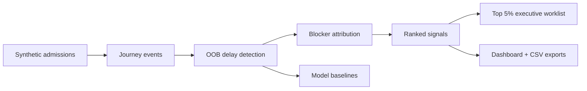

# Operational Delay Sentinel

<p align="center">
  
  
  
  
  
</p>

<p align="center"><strong>A synthetic hospital-flow app for finding out-of-bounds discharge delays, ranking operational blockers, and turning them into dashboard-ready action lists.</strong></p>

Operational Delay Sentinel is a small, self-contained prototype for hospital operations teams who need to answer a deceptively hard question:

> Which discharge delays are no longer normal clinical variation, and which operational blocker should we look at first?

It generates synthetic hospital-flow data, flags out-of-bounds operational delay signals, attributes likely blockers, trains local statistical baselines, and produces an interactive HTML dashboard plus CSV worklists. It is intentionally **dashboard-first and CSV-first**: no EHR write-back, no PHI, no punitive language, and no dependency on a live hospital system.

## Why this exists

Hospital discharge delays are not just statistical outliers. A five-day miss on predicted discharge timing may be caused by an ALC/community placement wait, Friday service closure, delayed imaging, late blood results, ECG access, transport coordination, or home-care confirmation. Treating all of that as model error hides the operational story.

This app reframes those misses as **reviewable delay signals**:

- soft operational language,
- ranked recoverable bed-hours,
- clear recommended owners,
- auditable CSV action lists,
- dashboard filters for facility, unit, signal family, and exact blocker.

## Screenshots

### Balanced run, detected as ALC/community-capacity dominant


### Diagnostics-heavy run, detected as diagnostics-access dominant


### Weekend-flow run, detected as Friday/weekend gap dominant


## What it detects

The current synthetic workflow ranks blockers such as:

- ALC placement wait,
- Friday/weekend discharge gap,
- home-care confirmation wait,
- therapy assessment stall,
- transport delay,
- pharmacy discharge delay,
- radiology CT turnaround delay,
- radiology MRI access delay,
- radiology ultrasound turnaround delay,
- blood testing turnaround delay,
- ECG availability delay,
- diagnostic sign-off stall,
- unit-level bed-flow bottleneck.

## How the sentinel works



The detection layer uses three complementary signals:

- robust length-of-stay control limits by facility, service line, case mix group, and frailty band,
- post-medically-ready hard caps,
- daily control-chart signals for systemic unit/facility patterns.

The action layer keeps both views:

- `delay_resolution_actions_all.csv`: complete action inventory,
- `delay_resolution_actions.csv`: tightened executive worklist, top 5% by recoverable bed-hours and priority.

## Quick start

```bash
python3 -m venv .venv
source .venv/bin/activate
pip install -e .
```

Run the balanced synthetic case:

```bash
python3 run_discharge_delay_workflow.py \
  --facilities 4 \
  --days 90 \
  --encounters-per-day 180 \
  --oob-rate-target 0.05 \
  --post-ready-hard-cap-hours 48 \
  --weekend-service-reduction 0.35 \
  --alc-pressure-multiplier 1.25 \
  --scenario-mode balanced \
  --out outputs/synthetic_90d_balanced_v1 \
  --print-top-n 5
```

Run the diagnostics-heavy and weekend-flow scenarios:

```bash
python3 run_discharge_delay_workflow.py --scenario-mode diagnostics_heavy --out outputs/synthetic_90d_diagnostics_v1
python3 run_discharge_delay_workflow.py --scenario-mode weekend_flow_gap --out outputs/synthetic_90d_weekend_v1
```

## Scenario modes

| Mode | Purpose |
|---|---|
| `balanced` | Mixed operational delay pressure. Useful default demo. |
| `alc_heavy` | ALC, LTC, rehab, home care, and community-capacity pressures dominate. |
| `diagnostics_heavy` | Radiology, blood testing, ECG, and diagnostic sign-off delays dominate. |
| `weekend_flow_gap` | Friday/weekend service gaps dominate recoverable bed-hours. |

The app also detects the scenario actually produced by the data in `scenario_detection_summary.csv`. That matters because the requested scenario and the observed signal mix can differ.

## Latest synthetic run results

All three runs used 4 facilities, 90 days, and 64,800 admissions.

| Scenario mode | Detected scenario | OOB signals | Executive actions | Top signal family | Family share | Top blocker |
|---|---|---:|---:|---|---:|---|
| `balanced` | `alc_heavy_detected` | 6,961 | 349 | `alc_community_capacity` | 61.26% | ALC placement wait |
| `diagnostics_heavy` | `diagnostics_heavy_detected` | 13,825 | 692 | `diagnostics_access` | 53.29% | home care confirmation wait |
| `weekend_flow_gap` | `weekend_flow_gap_detected` | 11,362 | 569 | `weekend_flow_gap` | 91.46% | Friday/weekend discharge gap |

The diagnostics-heavy run is intentionally interesting: diagnostics access dominates at the family level, while the single highest ranked blocker row can still be home care or transport because individual cases may have larger recoverable bed-hours. That is realistic and useful: leadership gets both the system-level pattern and the patient-flow worklist.

Full run summary:

- `docs/scenario_run_summary.csv`
- `docs/model_metrics_summary.csv`

## Dashboard features

The generated dashboard includes:

- KPI cards,
- recoverable bed-hours bar chart,
- OOB trend SVG chart,
- scenario detection mix,
- ranked actionable signals,
- executive worklist,
- control-chart daily metrics,
- filters for facility, unit, signal family, and exact blocker,
- clickable bars that filter the tables,
- visible-row CSV export buttons,
- print/save-PDF support.

## Dashboard screenshot/export

Install screenshot support:

```bash
pip install '.[screenshot]'
python3 -m playwright install chromium
```

Export dashboard HTML and PNG:

```bash
python3 scripts/export_dashboard.py \
  --dashboard outputs/synthetic_90d_weekend_v1/operational_delay_dashboard.html \
  --out exports \
  --png
```

## Main outputs

| File | Purpose |
|---|---|
| `patient_admission_events.parquet` | Synthetic admission-level table. |
| `patient_journey_events.parquet` | Synthetic event-level journey table. |
| `bed_resource_daily.parquet` | Bed occupancy and resource context. |
| `service_availability.parquet` | PT, OT, imaging, pharmacy, home care, transport, LTC, rehab availability. |
| `out_of_bounds_delay_flags.parquet` | OOB delay signals and priority scores. |
| `delay_blocker_attribution.parquet` | Likely blocker attribution and evidence. |
| `ranked_actionable_signals.csv` | Ranked facility/unit/service/signal table. |
| `delay_resolution_actions.csv` | Top 5% executive worklist. |
| `delay_resolution_actions_all.csv` | Full action inventory. |
| `scenario_detection_summary.csv` | Detected scenario mix by signal family. |
| `operational_delay_dashboard.html` | Interactive local dashboard. |
| `discharge_delay_sentinel_report.md` | Markdown run report. |
| `discharge_delay_sentinel_report.html` | HTML run report. |

## Model baselines

The workflow trains local statistical baselines:

- `HistGradientBoostingRegressor`,
- `ExtraTreesRegressor`,
- `HistGradientBoostingClassifier`,
- `ExtraTreesClassifier`.

The models are not the whole product. They are used to estimate expected LOS and OOB risk, while the operational layer converts delay signals into explainable blockers and worklists.

## Language and governance

This project deliberately avoids punitive terminology. It uses terms like:

- delay signal,
- operational blocker,
- capacity constraint,
- unresolved discharge dependency,
- recoverable bed-hours.

The intended first deployment pattern is shadow mode:

1. generate dashboard and CSV outputs,
2. review with discharge huddles and patient-flow teams,
3. record adoption and reasons-not-actioned,
4. only later consider idempotent integration with operational systems.

## Synthetic data only

This repository uses fully synthetic data. It contains no PHI and makes no claim about a specific real hospital, health authority, or provincial program.

## Cute but serious roadmap

- Add a proper web front end around the generated dashboard.
- Add adoption simulation: accepted, deferred, already resolved, not actionable.
- Add idempotent recommendation IDs for repeated daily runs.
- Add scenario comparison pages.
- Add optional integration adapters for CSV/SFTP/data-warehouse handoff.

## License

MIT.
