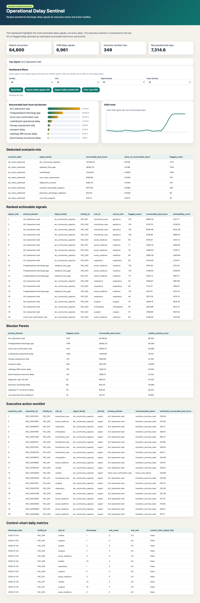
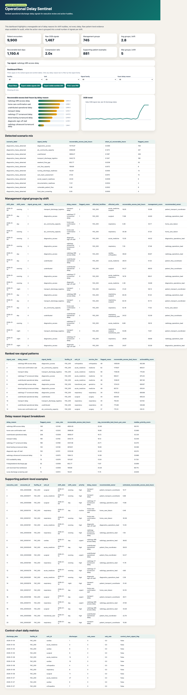
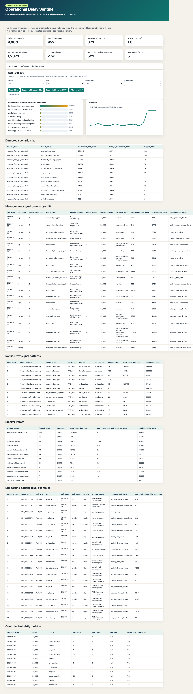
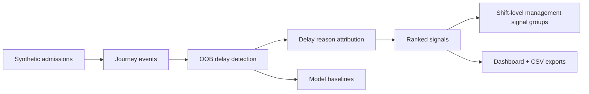

# Operational Delay Sentinel

<p align="center">
  
  
  
  
  
</p>

<p align="center"><strong>A synthetic hospital-flow app for finding out-of-bounds discharge delays, grouping them into plain-language delay reasons, and turning them into dashboard-ready action lists.</strong></p>

<p align="center"><a href="https://andrewmichael2020.github.io/discharge-delay-flags/demo/"><strong>Live GitHub Pages demo</strong></a> · <a href="demo/index.html">Demo source</a> · <a href="docs/METRICS_AND_SIGNALS.md">Metric definitions</a></p>

Operational Delay Sentinel is a small, self-contained prototype for hospital operations teams who need to answer a deceptively hard question:

> Which discharge delays are no longer normal clinical variation, and which delay reason should we look at first?

It generates synthetic hospital-flow data, flags out-of-bounds operational delay signals, attributes likely operational delay reasons, trains local statistical baselines, and produces an interactive HTML dashboard plus CSV worklists. It is intentionally **dashboard-first and CSV-first**: no EHR write-back, no PHI, no punitive language, and no dependency on a live hospital system.

The important design choice is signal compression: thousands of patient-level rows are rolled into **3-5 management signal groups per shift**, while case counts and recoverable bed-hours are reported separately. A delay reason can be high-impact without being high-volume, and common service throughput is not treated as a crisis just because it is frequent.

## Why this exists

Hospital discharge delays are not just statistical outliers. A five-day miss on predicted discharge timing may be caused by an ALC/community placement wait, Friday service closure, delayed imaging, late blood results, ECG access, transport coordination, or home-care confirmation. Treating all of that as model error hides the operational story.

This app reframes those misses as **reviewable delay signals**:

- soft operational language,
- ranked recoverable excess bed-hours,
- clear recommended owners,
- auditable CSV action lists,
- dashboard filters for facility, unit, signal family, and exact delay reason.

## Screenshots

### Balanced one-hospital run, mixed signals with weekend/community pressure



### Diagnostics-heavy run, detected as diagnostics-access dominant



### Weekend-flow run, detected as Friday/weekend gap dominant



## GitHub Pages demo

A cleaner public demo lives in [`demo/index.html`](demo/index.html). It is designed for GitHub Pages and tells one simple story: how a large synthetic hospital turns noisy discharge-delay evidence into a small, plain-language action agenda.

The demo uses committed JSON extracts generated from `sample_data/`, so it does not need Python, Parquet, a backend service, or real patient data in the browser. To refresh it after updating sample data, run:

```bash
python3 scripts/build_demo.py
```

To publish it with GitHub Pages, set Pages to serve from the `main` branch and open `/demo/`. The static page includes scenario tabs, executive KPI cards, delay-reason impact charts, a control-chart view, and example CSV-ready action rows.

## What it detects

The dashboard presents operational diagnostic KPIs. These are not clinical quality judgements or staff performance ratings; they are review prompts that help patient-flow teams decide what to look at first.

### Core KPI definitions

| KPI | Formula | What it means | How to use it |
|---|---|---|---|
| Patient encounters | `count(patient_admission_events.encounter_id)` | Number of synthetic admissions/encounters in the run. | Denominator for signal rates. |
| Raw OOB delay signals | `count(out_of_bounds_delay_flags where oob_flag = true)` | Encounter-level rows that crossed at least one out-of-bounds rule. | Audit evidence, not the huddle worklist. |
| OOB signal rate | `raw_oob_delay_signals / patient_encounters` | Share of encounters with an out-of-bounds delay signal. | Overall operating pressure indicator. |
| Management signal groups | `count(management_signal_groups)` | Shift-level grouped signals after compressing raw patient rows. | Main huddle/action surface. |
| Average groups per shift | `management_signal_groups / total_shift_windows` | Typical number of signals a shift team reviews. | Keep manageable, usually under 3-5. |
| Delay-reason case rate | `flagged_cases_for_delay_reason / patient_encounters` | How often a specific reason appears. | Prevents overreacting to normal high-volume work. |
| Recoverable excess bed-hours | `sum(estimated_recoverable_bed_hours)` | Estimated bed-hours above expected operational thresholds. | Measures impact, not case count. |
| Bed-hour share by signal family | `family_recoverable_bed_hours / total_recoverable_bed_hours` | Concentration of impact in one family. | Used to label scenarios as mixed or dominant. |
| Compression ratio | `raw_oob_delay_signals / management_signal_groups` | How much raw evidence is compressed into huddle signals. | Shows whether the worklist is manageable. |
| Priority score | `0.65 * hours_above_limit + 0.55 * post_ready_excess_hours + 18 * post_ready_hard_cap_flag + 8 * control_chart_signal_flag` | Sorting score for operational review. | Higher means review sooner. |

### Core flag formulas

```text
robust_los_oob_flag = actual_los_hours > oob_limit_hours
post_ready_hard_cap_flag = hours_after_medically_ready > 48
control_chart_signal_flag = daily_oob_rate > upper_control_limit
oob_flag = robust_los_oob_flag OR post_ready_hard_cap_flag OR control_chart_signal_flag
```

```text
post_ready_excess_hours = max(hours_after_medically_ready - 48, 0)
los_excess = max(actual_los_hours - oob_limit_hours, 0)

if post_ready_excess_hours > 0:
    estimated_recoverable_bed_hours = min(los_excess, post_ready_excess_hours)
else:
    estimated_recoverable_bed_hours = 0.35 * los_excess
```

### Delay reason KPI dictionary

| Delay reason / KPI | Signal family | Definition | Formula / detection evidence | Default owner | Caveat |
|---|---|---|---|---|---|
| ALC placement wait | `alc_community_capacity` | Medically stable patient appears to be waiting for LTC, rehab, or alternate-level placement. | ALC status plus LTC/rehab referral or placement timing; KPI rate = `ALC placement wait cases / encounters`. | Transition services lead | High-impact but should be a small subset, not a dominant volume. |
| Friday/weekend discharge gap | `weekend_flow_gap` | Discharge readiness crosses a period with reduced weekend or Friday-afternoon service availability. | Medically ready near Friday/weekend plus delayed discharge; KPI rate = `Friday/weekend cases / encounters`. | Site operations director | Not every weekend discharge is a problem; public demo caps this near 5% or less. |
| Home-care confirmation wait | `alc_community_capacity` | Discharge depends on home-care confirmation or community support setup. | Home-care referral and confirmation timestamps; KPI rate = `home-care wait cases / encounters`. | Home-care liaison | Can overlap with frailty, ALC, and social-support needs. |
| Therapy assessment stall | `care_team_assessment` | PT/OT or therapy assessment takes longer than expected for a discharge-dependent case. | Assessment requested/completed timestamps above expected window. | Therapy services manager | Some delays reflect clinically appropriate assessment complexity. |
| Transport delay | `transport_discharge_logistics` | Discharge or transfer waits on transport coordination. | Transport requested/completed timestamps or discharge-order-to-transport lag. | Patient transport coordinator | May reflect external ambulance, family pickup, or destination constraints. |
| Pharmacy discharge delay | `pharmacy_discharge_readiness` | Medication reconciliation or discharge medication readiness delays discharge. | Discharge order timing plus pharmacy dependency timing. | Pharmacy operations lead | Complex medication reviews may be appropriate and safety-protective. |
| Radiology CT turnaround delay | `diagnostics_access` | CT completion or reporting appears discharge-dependent and delayed. | CT ordered/completed timestamps above expected discharge-dependent window. | Radiology operations lead | Frequent CT use is normal; only threshold-crossing cases signal. |
| Radiology MRI access delay | `diagnostics_access` | MRI access, completion, or reporting appears discharge-dependent and delayed. | MRI ordered/completed timestamps above expected window. | Radiology operations lead | MRI scarcity may be structural, not locally fixable same day. |
| Radiology ultrasound turnaround delay | `diagnostics_access` | Ultrasound completion or reporting appears discharge-dependent and delayed. | Ultrasound ordered/completed timestamps above expected window. | Radiology operations lead | Prioritization may be clinically appropriate. |
| Blood testing turnaround delay | `diagnostics_access` | Blood collection, processing, or result release appears discharge-dependent and delayed. | Blood test ordered/available timestamps above expected window. | Laboratory operations lead | Repeat or abnormal tests may be clinically necessary. |
| ECG availability delay | `diagnostics_access` | ECG completion or interpretation appears discharge-dependent and delayed. | ECG ordered/completed timestamps above expected window. | Cardiology diagnostics lead | Clinical urgency and interpretation requirements matter. |
| Diagnostic sign-off stall | `diagnostics_access` | Final diagnostic completion, sign-off, or consultant interpretation appears to hold discharge. | Diagnostic completion/sign-off timing above expected window. | Diagnostics operations lead | May reflect specialist dependency rather than diagnostic department delay. |
| Unit-level bed-flow bottleneck | `unit_flow_capacity` | A facility/unit/day has an unusual concentration of OOB delay signals. | `daily_oob_rate > centerline + 3 * sigma`. | Unit operations manager | Pattern signal only; not an individual-case conclusion. |
| Triage screening backlog | `front_door_screening` | Front-door screening delay may contribute to downstream flow pressure. | Triage screening requested/completed timestamps above expected window. | Triage operations lead | Flow signal, not discharge-only signal. |
| Nurse discharge screening wait | `nursing_discharge_readiness` | Nursing discharge readiness checklist or screening is delayed for a discharge-dependent case. | Nurse screening requested/completed timestamps above expected window. | Nursing flow lead | Staffing and acuity context should be reviewed before action. |
| Vulnerable patient porter wait | `vulnerable_patient_flow` | Mobility-limited or vulnerable patients wait for safe movement or porter support. | Porter request/completion timestamps plus frailty/mobility context. | Patient transport coordinator | Should be handled as access and safe-flow support, not waste. |
| Social work assessment wait | `social_support_readiness` | Social work assessment is delayed for a discharge-dependent case. | Social work assessment requested/completed timestamps above expected window. | Social work lead | May indicate complexity rather than avoidable delay. |
| Interpreter availability wait | `social_support_readiness` | Interpreter support is delayed for discharge-dependent communication. | Interpreter requested/completed timestamps above expected window. | Language services lead | Equity and access support should not be sacrificed for speed. |
| Discharge documentation readiness wait | `documentation_readiness` | Required discharge documentation is not ready in expected window. | Documentation started/ready timestamps above expected window. | Unit clerk lead | Documentation quality should not be reduced to improve speed. |
| Unattributed operational delay | `unattributed` | OOB delay exists but no single dependency explains it. | OOB flag without clear event-level attribution. | Patient flow coordinator | Often points to missing workflow instrumentation or data quality gaps. |

## How the sentinel works



The detection layer uses three complementary signals:

- robust length-of-stay control limits by facility, service line, case mix group, and frailty band,
- post-medically-ready hard caps,
- daily control-chart signals for systemic unit/facility patterns.

The action layer keeps three views:

- `delay_blocker_attribution.parquet`: raw patient-level delay-reason evidence,
- `management_signal_groups.csv`: capped shift-level management agenda, default 5 groups per shift,
- `delay_resolution_actions.csv`: supporting patient examples for the selected management groups.

## Quick start

```bash
python3 -m venv .venv
source .venv/bin/activate
pip install -e .
```

Run the one-large-hospital balanced synthetic case:

```bash
python3 run_discharge_delay_workflow.py \
  --facilities 1 \
  --days 90 \
  --encounters-per-day 110 \
  --oob-rate-target 0.05 \
  --post-ready-hard-cap-hours 48 \
  --weekend-service-reduction 0.35 \
  --alc-pressure-multiplier 1.25 \
  --scenario-mode balanced \
  --out outputs/synthetic_90d_large_hospital_balanced_v1 \
  --print-top-n 5
```

Run the diagnostics-heavy and weekend-flow scenarios:

```bash
python3 run_discharge_delay_workflow.py --scenario-mode diagnostics_heavy --out outputs/synthetic_90d_large_hospital_diagnostics_v1
python3 run_discharge_delay_workflow.py --scenario-mode weekend_flow_gap --out outputs/synthetic_90d_large_hospital_weekend_v1
```

## Scenario modes

| Mode | Purpose |
|---|---|
| `balanced` | Mixed operational delay pressure. Useful default demo. |
| `alc_heavy` | ALC, LTC, rehab, home care, and community-capacity pressures dominate. |
| `diagnostics_heavy` | Radiology, blood testing, ECG, and diagnostic sign-off delays dominate. |
| `weekend_flow_gap` | Friday/weekend service gaps dominate recoverable bed-hours. |

The app also detects the scenario actually produced by the data in `scenario_detection_summary.csv`. If no single signal family contributes at least 40% of recoverable excess bed-hours, the run is labelled mixed instead of forcing a misleading dominant category.

## Latest synthetic run results

All three latest runs use one large synthetic hospital, 90 days, and 9,900 admissions. Earlier health-authority-scale stress runs are intentionally not used as the public demo baseline.

| Scenario mode | Detected scenario | Raw OOB signals | Management groups | Avg groups / shift | Compression | ALC cases | ALC case rate | Weekend cases | Weekend case rate | Top signal family | Family share |
|---|---|---:|---:|---:|---:|---:|---:|---:|---:|---|---:|
| `balanced` | `mixed_operational_pressure_detected` | 811 | 543 | 2.25 | 1.49x | 43 | 0.43% | 119 | 1.20% | `weekend_flow_gap` | 34.19% |
| `diagnostics_heavy` | `diagnostics_heavy_detected` | 1,467 | 745 | 2.79 | 1.97x | 7 | 0.07% | 55 | 0.56% | `diagnostics_access` | 54.95% |
| `weekend_flow_gap` | `weekend_flow_gap_detected` | 910 | 456 | 1.85 | 2.00x | 15 | 0.15% | 466 | 4.71% | `weekend_flow_gap` | 91.42% |

The latest runs intentionally separate **raw evidence volume**, **case rates**, and **recoverable excess bed-hours**. Raw OOB rows remain available for audit, but the dashboard caps the shift-level agenda to a manageable number of signal groups. This prevents normal large-system friction, such as radiology throughput at scale, from being mislabeled as a crisis simply because it is frequent. ALC/community-capacity rows are bounded as a small high-impact subset rather than a structurally dominant source of synthetic delay.

Full run summary:

- `docs/scenario_run_summary.csv`
- `docs/model_metrics_summary.csv`
- `docs/METRICS_AND_SIGNALS.md`


### Signal-volume guardrails

The public demo is tuned so signal volumes stay believable for one large hospital:

- no delay-reason group should represent more than about `5%` of all encounters, even in a stress scenario,
- most delay reasons should sit around `1%` to `5%` of encounters or lower,
- common throughput processes, such as radiology or blood testing, are treated as delay reasons only when they cross timing and actionability thresholds,
- management views stay grouped to a small number of shift-level signals rather than exposing every patient-level row as an executive action.

This keeps the dashboard useful for a huddle: it points to a few practical signals, not a wall of normal operating friction.

### One-hospital interpretation

The public demo is intentionally sized like a single large hospital, not a provincial or health-authority-wide extract. The current default produces:

- `9,900` admissions over 90 days,
- `811` to `1,467` raw OOB delay signals depending on scenario,
- `456` to `745` shift-level management groups,
- about `1.85` to `2.79` management groups per shift,
- ALC case rates between `0.07%` and `0.43%`.

That distinction matters: ALC is represented as a small, high-impact subset. Recoverable excess bed-hours are not case counts.

## Metrics and signal definitions

The dashboard metrics are operational diagnostic KPIs. They are documented in detail in [`docs/METRICS_AND_SIGNALS.md`](docs/METRICS_AND_SIGNALS.md), including formulas for OOB flags, priority score, recoverable excess bed-hours, management signal grouping, and every delay reason shown in the dashboard.

## Dashboard features

The generated dashboard includes:

- KPI cards,
- recoverable excess bed-hours bar chart,
- OOB trend SVG chart,
- scenario detection mix,
- ranked actionable signals,
- executive worklist,
- control-chart daily metrics,
- filters for facility, unit, signal family, and exact operational signal,
- clickable bars that filter the tables,
- visible-row CSV export buttons,
- print/save-PDF support.

## Dashboard screenshot/export

Install screenshot support:

```bash
pip install '.[screenshot]'
python3 -m playwright install chromium
```

Export dashboard HTML and PNG:

```bash
python3 scripts/export_dashboard.py \
  --dashboard outputs/synthetic_90d_large_hospital_weekend_v1/operational_delay_dashboard.html \
  --out exports \
  --png
```


## GitHub repository structure

```text
.
├── README.md
├── pyproject.toml
├── requirements.txt
├── run_discharge_delay_workflow.py
├── scripts/
│   └── export_dashboard.py
├── src/discharge_delays/
│   └── workflow.py
├── docs/
│   ├── scenario_run_summary.csv
│   ├── model_metrics_summary.csv
│   └── screenshots/
│       ├── balanced-dashboard.png
│       ├── diagnostics-dashboard.png
│       └── weekend-dashboard.png
├── sample_data/
│   ├── balanced/
│   ├── diagnostics_heavy/
│   └── weekend_flow_gap/
└── .github/workflows/ci.yml
```

Generated `outputs/`, `exports/`, local data, virtual environments, timestamped screenshot exports, and local implementation notes are ignored. The repository keeps only curated screenshots and summary CSVs for the README.

## Included sample synthetic data

The repository includes a curated sample dataset under [`sample_data/`](sample_data/). It contains the three final one-large-hospital scenario runs used in the README:

| Folder | Scenario | Scale |
|---|---|---|
| `sample_data/balanced/` | Mixed operational pressure | 1 hospital, 90 days, 9,900 encounters |
| `sample_data/diagnostics_heavy/` | Diagnostics-access stress | 1 hospital, 90 days, 9,900 encounters |
| `sample_data/weekend_flow_gap/` | Weekend-flow stress | 1 hospital, 90 days, 9,900 encounters |

The larger local `outputs/` tree is intentionally ignored because it contains earlier exploratory and health-authority-scale runs.

## Main outputs

| File | Purpose |
|---|---|
| `patient_admission_events.parquet` | Synthetic admission-level table. |
| `patient_journey_events.parquet` | Synthetic event-level journey table. |
| `bed_resource_daily.parquet` | Bed occupancy and resource context. |
| `service_availability.parquet` | PT, OT, imaging, pharmacy, home care, transport, LTC, rehab availability. |
| `out_of_bounds_delay_flags.parquet` | OOB delay signals and priority scores. |
| `delay_blocker_attribution.parquet` | Likely delay-reason attribution and evidence. |
| `ranked_actionable_signals.csv` | Raw ranked facility/unit/service/signal pattern table. |
| `management_signal_groups.csv` | Capped 3-5-per-shift management agenda. |
| `management_signal_kpis.csv` | Signal compression and manageability KPIs. |
| `delay_resolution_actions.csv` | Supporting patient-level examples for management groups. |
| `delay_resolution_actions_all.csv` | Full raw action inventory. |
| `scenario_detection_summary.csv` | Detected scenario mix by signal family. |
| `operational_delay_dashboard.html` | Interactive local dashboard. |
| `discharge_delay_sentinel_report.md` | Markdown run report. |
| `discharge_delay_sentinel_report.html` | HTML run report. |

## Model baselines

The workflow trains local statistical baselines:

- `HistGradientBoostingRegressor`,
- `ExtraTreesRegressor`,
- `HistGradientBoostingClassifier`,
- `ExtraTreesClassifier`.

The models are not the whole product. They are used to estimate expected LOS and OOB risk, while the operational layer converts delay signals into explainable delay reasons and worklists.

## Language and governance

This project deliberately avoids punitive terminology. It uses terms like:

- delay signal,
- delay reason,
- capacity constraint,
- unresolved discharge dependency,
- recoverable excess bed-hours.

The intended first deployment pattern is shadow mode:

1. generate dashboard and CSV outputs,
2. review with discharge huddles and patient-flow teams,
3. record adoption and reasons-not-actioned,
4. only later consider idempotent integration with operational systems.

## Synthetic data only

This repository uses fully synthetic data. It contains no PHI and makes no claim about a specific real hospital, health authority, or provincial program.

## Cute but serious roadmap

- Add a proper web front end around the generated dashboard.
- Add adoption simulation: accepted, deferred, already resolved, not actionable.
- Add idempotent recommendation IDs for repeated daily runs.
- Add scenario comparison pages.
- Add optional integration adapters for CSV/SFTP/data-warehouse handoff.

## License

MIT.
